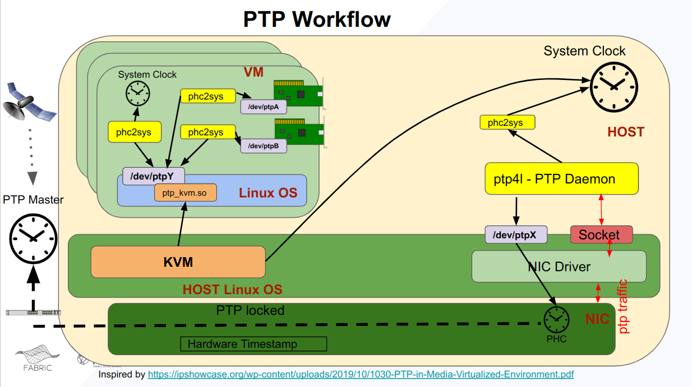

# PTP
## Introduction
This repository  consists of an ansible directory structure that contains an ansible role that would deploy the linuxptp software package into FABRIC VMs in the experimenter's FABRIC slice. A sample playbook [playbook_fabric_experiment_ptp.yml](ansible/playbook_fabric_experiment_ptp.yml) is also included that demonstrates its use in an ansible playbook.

## PTP Support in FABRIC Experiments
FABRIC provisions KVM based virtual machines VMs for user experiment nodes. A modern Linux operating system (using a modern kernel > 3.x ) support a device called ptp_kvm that emulates a PTP clock device. The host system KVM provides this ptp_kvm device located inside the virtual machine its system time. The host KVM uses the system clock as its time source which is synchronized by another instance of the linuxptp software running on the host. The details of this process is illustrated in the diagram below. 

So as long as the host system clock is synchronized using the PTP GPS clock, a VM is guaranteed to recieve accurate PTP timing via the ptp_kvm linux device inside the VM. 
Thus using the ptp_kvm device as a time source inside the VM, a user can snchronize the VM system clock and any other PHC (Time clocks) associated with the Smart-NICs/Shared-NICs provided in FABRIC for experimenter use.
Each PHC device is its own independent free running clock unless its synchronized using an alternate source.

An important fact to note is that the process of getting time into the VM involves multiple hops/transfers. At each transfer there is a possibility of a delay (order of nanoseconds), thus FABRIC claims an accuracy of tens of microseconds when PTP is used inside a VM.

## About linuxptp software components used
### ptp4l
ptp4l is an implementation of the Precision Time Protocol (PTP) according to IEEE standard 1588 for Linux
### phc2sys
phc2sys  is  a  program  which  synchronizes two or more clocks in the system. Typically, it is used to synchronize the system clock to a PTP hardware clock (PHC)
### phc_ctl
phc_ctl is a program which can be used to directly control a PHC clock device. It can be used to
* compare and clock device (PHC) wrt system clock
* set/modify a clock device (PHC)
* get/obtain time from a (PHC)

[See FABRIC KNIT7: Tutorial 1 Precision Time Measurements](https://github.com/fabric-testbed/jupyter-examples/blob/main/fabric_examples/public_demos/KNIT7/Tutorial1_Precision_Time_Measurements_in_FABRIC/knit7_demo_precision_timing.ipynb). Read linux man pages for more details.
## About the `linuxptp` Ansible Role
`DISCLAIMER`: This ansible role is designed specifically for the FABRIC Project usecase where in the source of the timing is ptp_kvm and sink/destination is `System Clock` and/or `Dataplane NIC (Smart/Shared)`

The default behaviour of this ansible playbook and role is to synchronize the system clock and all FABRIC shared/smart NICs (Mellanox branded) with PTP time obtained from ptp_kvm . If a user would not like to synchronize the system clock and/or other clocks on NIC cards(PHCs) present in a node of the slice, they can provide exclusions as an additional json file to the ansbile command. The contents of the json should look like
```
{ "SYNC_SYSTEM_CLOCK" : < True | FALSE >,
  "AVOID_IFACES" : [<linux iface name_1 >,<linux iface name_2 >,....]
}
```
Any node that does use a json will be assumed to be an unrestricted install.
Any parameters not present in a node specified will assume a default value of ```AVOID_IFACES : []``` and ```'SYNC_SYSTEM_CLOCK' : True```
```
{ "AVOID_IFACES": ["enp6s0"],"SYNC_SYSTEM_CLOCK": False}

{ "AVOID_IFACES": ["enp6s0","enp7s0"]}
```
### Steps/Tasks performed in the ansible role
1. Find all interface names on the node that are ptp capable. Exclude any that have been mentioned in "AVOID_IFACES"  - [(find_ptp_interfaces.yml)](https://github.com/fabric-testbed/ptp/blob/main/ansible/roles/linuxptp/tasks/find_ptp_interfaces.yml)
2. Check if ptp4l binary and its installed version. Avoid rebuilding/compiling the source if the version needed is already present.
3. Disable any other NTP software or daemon that would be modifying  the system clock
4. Enable the ptp_kvm linux kernel module using `modprobe`
5. Build systemd startup scripts that would control the start and stop of the needed daemons
6. Add rsyslog and logrorate rules to filter the logs generated to their log files instead of filling up default system log files.
7. Start/Stop needed daemons based on the node restrictions provided for each NIC and System Clock.

Some sample commands would look like
```
ansible-playbook --connection=local --inventory 127.0.0.1, --limit 127.0.0.1 playbook_fabric_experiment_ptp.yml --extra-vars @parameters.json

ansible-playbook --connection=local --inventory 127.0.0.1, --limit 127.0.0.1 playbook_fabric_experiment_ptp.yml --tags ptp_stop

ansible-playbook --connection=local --inventory 127.0.0.1, --limit 127.0.0.1 playbook_fabric_experiment_ptp.yml --extra-vars @parameters.json --tags ptp_install
```
### Implementation in FABRIC
This has been demonstrated in a [Hands-on Tutorial](https://github.com/fabric-testbed/jupyter-examples/blob/main/fabric_examples/public_demos/KNIT7/Tutorial1_Precision_Time_Measurements_in_FABRIC/start_here.ipynb) at [FABRIC KNIT 7 Workshop](https://whatisfabric.net/events/knit-7)
The tutorial can be run using your FABRIC account. Steps 1 thru 3 show how to Install Precision Timing and the restremaining steps present an example on a possible example on how you could use the accurate timing.
### How do i use Precision Timing in my FABRIC Experiment
This document shows how you would go about enabling Precision Timing in your Fabric Slice. Once this step is completed, the System Clock and NICS should be capable of providing your GPS synchronized timing provided that you use the right tools and options. For example `tcpdump` present a `-J/-j` option to allow you to use. One other tool called `phc_ctl get` would get you an accurate timestamp at the instant the tool is called. You could use that for event timestamping in your program. The tuortial mentioned earlier demonstrates this.

## Other possibilities
If a scenario arises where in the GPS time source could be connected over the FABRIC dataplane, then its is possible that the Smart/Shared NICs could be the first consumer of the timing PTP packets (running ptp4l) and then synchronize the VM system clock using the time from the NIC(phc2sys). In such a scenario, the ptp_kvm would not be needed.

## References
* https://kimmo.suominen.com/blog/2022/09/virtual-ptp-hardware-clock-on-kvm-guests/
* https://sanjuroe.dev/sync-kvm-guest-using-ptp
* https://engineering.fb.com/2022/11/21/production-engineering/future-computing-ptp/
* https://engineering.fb.com/2022/11/21/production-engineering/future-computing-ptp/
* [Youtube Video - Introduction to Precision Time Protocol (PTP) - CISCO](https://www.youtube.com/watch?v=ovzt3IUFbyo)
* [Using PTP - RedHat](https://access.redhat.com/documentation/en-us/red_hat_enterprise_linux/7/html/system_administrators_guide/ch-configuring_ptp_using_ptp4l#sec-Using_PTP)
* [Precision Time Protocol on Linux - Fujitsu](https://events.static.linuxfound.org/sites/events/files/slides/lcjp14_ichikawa_0.pdf)
* [PTP in Media Virtualized Environments](https://ipshowcase.org/wp-content/uploads/2019/10/1030-PTP-in-Media-Virtualized-Environment.pdf)